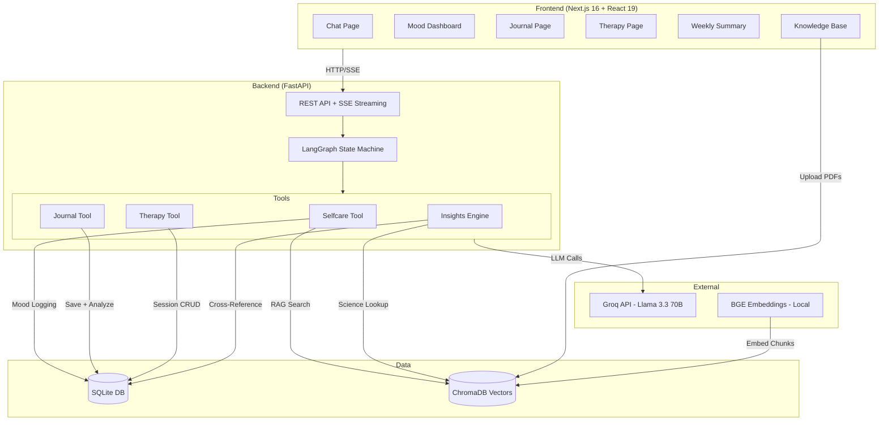
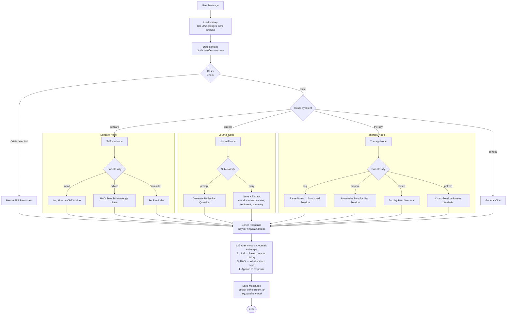
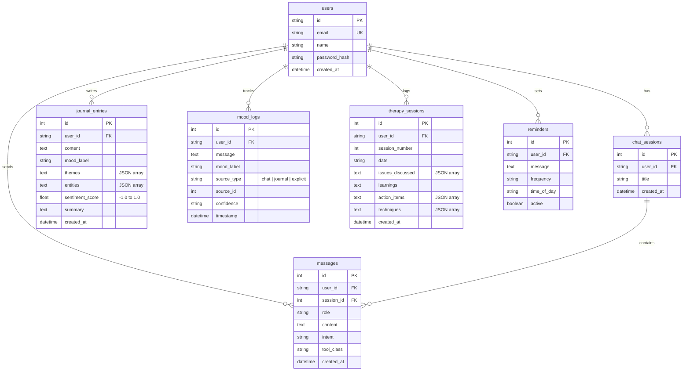
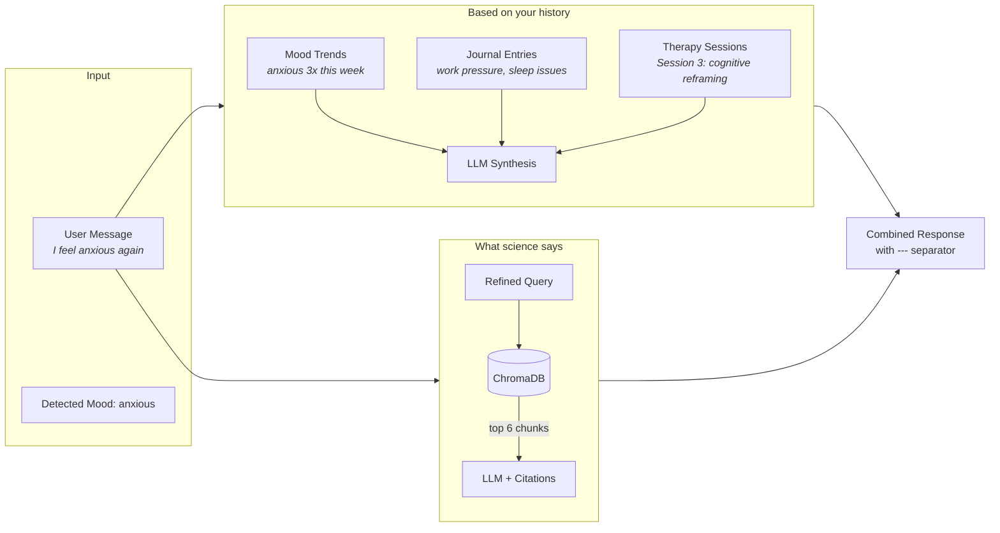

# MindMate

AI-powered mental health companion with journaling, mood tracking, therapy support, evidence-based advice (RAG), and crisis guardrails.

**Total running cost: $0** — Groq free tier + local embeddings + SQLite + ChromaDB.

---

## What It Does

You chat naturally with MindMate. Behind the scenes, a LangGraph state machine detects your intent and routes to the right tool — mood tracking, journaling, therapy support, or evidence-based advice. Everything is tracked, cross-referenced, and used to give you increasingly personalized responses.

### Chat
- Streaming responses with markdown rendering
- Multiple chat sessions (create, switch, delete)
- LLM-generated session titles
- Voice input via Web Speech API
- Message editing

### Mood Tracking
- **Passive detection** — picks up emotional signals from any message, no explicit logging needed
- **Source tracking** — moods from chat, journals, or explicit entries shown separately
- **Dashboard** — interactive line chart with mood-colored dots, distribution pie chart, streak counter
- **Weekly summary** — LLM-generated recap of mood trends, journal themes, therapy progress

### Journaling
- Write entries via dedicated editor or through chat
- Auto-extracts mood, themes, entities, sentiment score, and summary via LLM
- Weighted theme cloud (click to filter)
- Mood-colored left border on entry cards
- Sentiment indicator (green/amber/red dot)
- Full CRUD (create, edit, delete)

### Therapy Support
- Log sessions directly on the therapy page or via chat
- LLM parses freeform notes into structured fields: issues, learnings, action items, techniques
- Timeline view with numbered session badges
- Cross-session pattern analysis
- Session prep (what to discuss next based on your data)

### Knowledge Base (RAG)
- Upload mental health PDFs — chunked and embedded into ChromaDB
- Evidence-based responses cite specific pages from your documents
- Search with highlighted query matches
- Upload progress tracking

### Smart Split Responses
When you share something difficult, responses split into two sections:

```
Based on your history:
You've felt anxious 3 times this week. In Session #3, you worked on
cognitive reframing for similar frustration. Your journal from Monday
mentioned work pressure and sleep issues.

What science says:
Progressive muscle relaxation has shown effectiveness for anxiety
management. Start by tensing your fists for 5 seconds, then releasing...

---
[1] CBT Techniques for Anxiety, p. 18
```

"Based on your history" synthesizes moods, journals, and therapy sessions.
"What science says" pulls from uploaded PDFs with citations.
Only triggers on negative moods — positive messages get a warm response without unsolicited advice.

### Crisis Guardrails
Detects crisis language (suicidal ideation, self-harm) and immediately responds with professional resources:
- 988 Suicide & Crisis Lifeline
- Crisis Text Line (741741)
- IASP international resources

Runs before all other processing. Non-negotiable safety layer.

---

## Tech Stack

| Layer | Technology |
|-------|-----------|
| Frontend | Next.js 16, React 19, TypeScript, Tailwind CSS v4, shadcn/ui (base-ui), Recharts |
| Backend | FastAPI, LangGraph, LangChain, Pydantic |
| LLM | Groq (Llama 3.3 70B) free tier, OpenAI as fallback |
| Embeddings | BAAI/bge-small-en-v1.5 via sentence-transformers (local, no API cost) |
| Database | SQLite (local), PostgreSQL-ready via config |
| Vector Store | ChromaDB (local), pgvector-ready for production |
| Package Manager | uv (Python), npm (Node) |
| CI/CD | GitHub Actions (lint + test + build on PR) |

---

## Quick Start

### Prerequisites

- Python 3.11+
- Node.js 22+
- [uv](https://docs.astral.sh/uv/) — `brew install uv` or `curl -LsSf https://astral.sh/uv/install.sh | sh`
- A free [Groq API key](https://console.groq.com)

### Setup

```bash
git clone https://github.com/visakhpadmanabhan7/MindMate.git
cd MindMate

# Install Python dependencies
uv sync

# Configure environment
cp .env.example .env
# Edit .env → add your GROQ_API_KEY

# Index knowledge base PDFs (first time only)
uv run python -m app.scripts.index_pdfs
```

### Run

```bash
# Terminal 1 — Backend
uv run uvicorn app.main:app --reload

# Terminal 2 — Frontend
cd frontend && npm install && npm run dev
```

Open http://localhost:3000, register, start chatting.

### With Docker

```bash
docker compose up --build
```

---

## Architecture

### System Overview



### LangGraph Flow

Every message goes through this pipeline:



### Data Model



### Split Response Architecture



---

## Example Interactions

**Mood tracking:**
```
You:       I'm feeling really anxious about my presentation tomorrow
MindMate:  Mood logged as anxious.

           Based on your history:
           You've mentioned presentation anxiety in your journal last week.
           In Session #2, you practiced grounding techniques for similar situations.

           What science says:
           The 4-7-8 breathing technique can reduce acute anxiety: breathe in for
           4 seconds, hold for 7, exhale for 8. Repeat 3-4 times.
           [1] CBT Techniques for Anxiety, p. 23
```

**Journaling via chat:**
```
You:       Today I realized my stress comes from trying to please everyone
           at work. I need to set better boundaries.

MindMate:  Entry saved to your journal.

           Mood detected: stressed
           Themes: people-pleasing at work, boundary setting
           Summary: Recognizing that work stress stems from people-pleasing
           and deciding to set better boundaries.

           Feel free to share more or ask for a prompt.
```

**Therapy session logging:**
```
You:       Here are my therapy notes: We discussed social anxiety.
           My therapist suggested exposure therapy starting with small groups.
           Homework is to attend one social event this week.

MindMate:  Session #4 logged!
           Issues: social anxiety
           Techniques: exposure therapy
           Action items: attend one social event this week
```

**Journaling prompt:**
```
You:       Give me a journaling prompt about self-compassion

MindMate:  When was the last time you made a mistake and treated yourself
           the way you would treat a close friend? What would that friend
           say to you right now?
```

**Crisis detection:**
```
You:       I want to hurt myself

MindMate:  I'm really concerned about what you're sharing. Please reach out
           to these resources right away:

           988 Suicide & Crisis Lifeline — Call or text 988
           Crisis Text Line — Text HOME to 741741
           International: https://www.iasp.info/resources/Crisis_Centres/
```

---

## Project Structure

```
app/
  main.py                       # FastAPI routes (40+ endpoints)
  langraph_runner.py             # LangGraph state machine
  core/
    config.py                    # Centralized settings via pydantic-settings
    llm.py                       # LLM provider abstraction (Groq/OpenAI)
    vectorstore.py               # ChromaDB + BGE embeddings
    guardrails.py                # Crisis keyword detection
  db/
    engine.py                    # Async SQLAlchemy engine
    models.py                    # 7 tables: users, sessions, messages, journals, moods, therapy, reminders
    message_store.py             # Chat sessions + message CRUD + search
    setup_db.py                  # Schema creation + migrations
  tools/
    journaling/                  # Journal storage, analytics, theme aggregation, prompts
    selfcare/                    # Mood tracking, RAG tool, wellness reminders
    therapy/                     # Session parsing, pattern analysis, insights
    insights/                    # Cross-reference engine (history synthesis), weekly summary
  prompts/
    prompt_texts.py              # All LLM prompts (intent detection, mood classification,
                                 #   journal analysis, therapy parsing, history synthesis, etc.)

frontend/
  src/app/
    chat/page.tsx                # Chat with sessions, streaming, markdown, voice input
    dashboard/page.tsx           # Mood analytics (line chart, pie chart, stat cards)
    journal/page.tsx             # Journal editor, theme cloud, mood borders, sentiment
    therapy/page.tsx             # Timeline view, session creation form
    summary/page.tsx             # Weekly AI-generated summary
    knowledge/page.tsx           # PDF upload, RAG search with highlighting
    settings/page.tsx            # Account, data export
  src/components/
    sidebar.tsx                  # Navigation (sage green theme)
    markdown.tsx                 # react-markdown renderer for chat
    ui/toast.tsx                 # Toast notification system

tests/                           # 22 pytest tests (config, guardrails, journal, messages,
                                 #   mood, therapy, user management)
.github/workflows/ci.yml        # CI: ruff lint + pytest + npm build
docker-compose.yml               # Local Docker setup
```

## API Reference

### Chat & Sessions
| Method | Endpoint | Description |
|--------|----------|-------------|
| POST | `/api/v1/chat/stream` | Streaming chat via SSE |
| POST | `/api/v1/chat/sessions` | Create new session |
| GET | `/api/v1/chat/sessions` | List sessions |
| DELETE | `/api/v1/chat/sessions/{id}` | Delete session + messages |

### Messages
| Method | Endpoint | Description |
|--------|----------|-------------|
| GET | `/api/v1/messages` | History (filterable by session) |
| GET | `/api/v1/messages/search` | Search by text and/or intent |
| PUT | `/api/v1/messages/{id}` | Edit user message |

### Journal
| Method | Endpoint | Description |
|--------|----------|-------------|
| POST | `/api/v1/journal/entries` | Create (auto mood/theme/sentiment analysis) |
| GET | `/api/v1/journal/entries` | List (with search, pagination) |
| PUT | `/api/v1/journal/entries/{id}` | Edit (re-runs analysis) |
| DELETE | `/api/v1/journal/entries/{id}` | Delete |
| GET | `/api/v1/journal/themes` | Aggregated theme cloud |

### Mood
| Method | Endpoint | Description |
|--------|----------|-------------|
| GET | `/api/v1/mood/analytics` | Timeline, distribution, streaks, sources |
| GET | `/api/v1/mood/{id}/detail` | Detail with linked source content |

### Therapy
| Method | Endpoint | Description |
|--------|----------|-------------|
| POST | `/api/v1/therapy/sessions` | Create session |
| GET | `/api/v1/therapy/sessions` | List sessions |
| PUT | `/api/v1/therapy/sessions/{id}` | Edit session |

### Other
| Method | Endpoint | Description |
|--------|----------|-------------|
| GET | `/api/v1/summary/weekly` | AI-generated weekly summary |
| POST | `/api/v1/knowledge/upload` | Upload + index PDF |
| POST | `/api/v1/knowledge/search` | Search knowledge base |
| DELETE | `/api/v1/knowledge/{filename}` | Delete document + vectors |
| GET | `/api/v1/export` | Export all user data as JSON |

---

## Environment Variables

| Variable | Required | Default | Description |
|----------|----------|---------|-------------|
| `GROQ_API_KEY` | Yes | — | Free from [console.groq.com](https://console.groq.com) |
| `LLM_PROVIDER` | No | `groq` | `groq` or `openai` |
| `OPENAI_API_KEY` | No | — | Required only if using OpenAI provider |
| `DATABASE_URL` | No | SQLite at `app/data/mindmate.db` | PostgreSQL URL for production |
| `CORS_ORIGINS` | No | `http://localhost:3000` | Comma-separated allowed origins |
| `NEXT_PUBLIC_API_URL` | No | `http://localhost:8000` | Backend URL for frontend |

## Development

```bash
uv run pytest tests/ -v          # Run 22 backend tests
uv run ruff check app/ tests/    # Lint backend
cd frontend && npm run build     # Type-check + build frontend
```

## Disclaimer

MindMate is **not** a substitute for professional mental health support. If you are in crisis, contact the **988 Suicide & Crisis Lifeline** (call or text 988) or the **Crisis Text Line** (text HOME to 741741).

---

Built with [Groq](https://groq.com), [LangGraph](https://langchain-ai.github.io/langgraph/), [Next.js](https://nextjs.org), and [FastAPI](https://fastapi.tiangolo.com).
